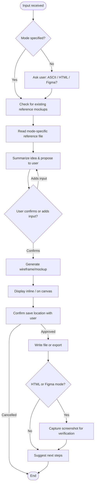

# BA Skill: Wireframe & Mockup Generation

## Purpose

Turn a screen description, user story, or SRS section into a visual artefact at the
right fidelity for the moment:

1. **ASCII mode** — Low-fidelity text wireframe. No tooling, pastes into any markdown doc, fastest way to align on layout.
2. **HTML mode** — Self-contained HTML file using Tailwind CSS CDN. A quick, presentable, clickable prototype without a design system.
3. **Figma mode** — Real frames drawn on a live Figma canvas via `figma-ui-mcp`. Production-quality, brand-accurate, shareable as a Figma link.

All three modes can describe the same screen — start low-fidelity to align on structure, then escalate to HTML or Figma once the layout is confirmed.

---

## Resource Map

| Resource | Purpose |
|---|---|
| [`references/ascii-wireframe-rules.md`](references/ascii-wireframe-rules.md) | Allowed/forbidden characters, layout rules, component patterns for ASCII mode |
| [`references/html-wireframe-guidelines.md`](references/html-wireframe-guidelines.md) | Tailwind CDN setup, design tokens, component patterns, fidelity levels, accessibility rules |
| [`references/figma-wireframe-guide.md`](references/figma-wireframe-guide.md) | figma-ui-mcp setup, MCP tool reference, colour/typography defaults, screen templates, multi-screen flows |

---

## Interactive Question Standard

Whenever this skill needs a decision from the user (mode, platform, theme, save location),
use `vscode_askQuestions` when available: concrete predefined options, a recommended default,
and `allowFreeformInput: true`. Fall back to a plain markdown question only if that tool is unavailable.

---

## When to Use

- Quick layout communication before formal design
- Screen structure review with non-design stakeholders
- Supplementing a user story or SRS section with a visual layout reference
- Generating a presentable HTML prototype for stakeholder review or a usability walkthrough
- Drawing a high-fidelity, brand-accurate Figma frame for design sign-off or client presentation

## When NOT to Use

- Detailed UI field-level specification (component type, validation, data source) → use a GUI/field-spec skill instead
- Full application development → hand off to a developer agent/skill
- Editing an existing production Figma file's real components without a design system read first (see Figma mode prerequisites)

---

## Mode Selection

When output mode is not specified, ask the user using `vscode_askQuestions`:

> **Output Format?**
> - **ASCII** — Text-based wireframe (paste in docs, chat, markdown). Lo-fi only, no tooling needed.
> - **HTML** — Single-file visual prototype (Tailwind CDN). Quick, clickable, no design system required.
> - **Figma** — Real frames on a live Figma canvas via figma-ui-mcp. High-fidelity, requires Figma Desktop + plugin running.

### Mode Comparison

| Aspect | ASCII | HTML (Tailwind) | Figma |
|--------|-------|------------------|-------|
| Output | Single `.md` block | Single `.html` file | Figma frame(s) in a live file |
| Tooling required | None | None (CDN only) | figma-ui-mcp MCP server + Figma Desktop plugin |
| Fidelity | Lo-fi | Lo/Mid/Hi-fi | Mid/Hi-fi |
| Interactions | None | Basic JS (tabs, modals, toggles) | Prototype navigation (`ON_CLICK` reactions) |
| Best for | Fast structural alignment | Stakeholder review, usability walkthrough | Design handoff, client presentation, design system reuse |

---

## Accepted Input Sources

| Input | Required | Description |
|-------|----------|--------------|
| Screen name | Yes | Name of the screen or modal |
| Layout description | Yes | What elements are on the screen |
| User role | Yes | Primary user of the screen |
| Platform | Yes | Mobile / Tablet / Desktop / Both |
| Output mode | No | ASCII / HTML / Figma. Default: ask user |
| Fidelity level | No | Lo-fi / Mid-fi / Hi-fi (HTML/Figma only). Default: Mid-fi |
| Theme | No | Light / Dark / Enterprise-neutral (Figma mode). Default: Light |
| Component list | No | Specific components to include |

---

## Design Reference: Existing Mockups

Before generating a new wireframe for a screen that belongs to an existing flow, check whether
the project already has reference mockups (exported screenshots, a `.fig` file, or prior
wireframes for related screens). If found:

1. Scan the reference folder/mockups to understand current design patterns.
2. Extract conventions: header layout, navigation style, card structure, button placement, spacing, colour usage.
3. Apply those conventions consistently in the new output.
4. Note the reference in the output (e.g. a comment at the top of an HTML file, or a line in the ASCII draft's metadata).

If no project convention is known, ask the user where reference mockups live before assuming there are none.

---

## Workflow



**Steps:**
1. **Collect inputs** — Screen name, layout description, user role, platform.
2. **Determine mode** — ASCII, HTML, or Figma (ask if not specified).
3. **Check existing mockups/design system** — Look for prior screens in the same flow, or a Figma design system (see Figma mode prerequisites).
4. **Read the mode-specific reference file** before generating anything.
5. **Summarize & propose** — Present a structured idea summary before generating:
   - Screen name & user role
   - Mode selected
   - Key sections / components planned
   - Platform target (Desktop / Mobile / Both)
   - Any assumptions made from the gathered inputs

   Ask: **"Does this match your expectation? Add any details or confirm to proceed."**
   Wait for confirmation or additional input before generating. Loop back if the user adds input.
6. **Generate** — Follow the mode's reference file, align with existing conventions, use domain-relevant content (never Lorem Ipsum).
7. **Display inline** — Show the result in chat (ASCII/HTML) or via screenshot (Figma) for immediate review.
8. **Confirm & save** — Ask the user for the target save location before writing any file, or before exporting a Figma frame as an image. If the project already has its own convention (e.g. a specs/wireframes folder), offer it as the recommended default; otherwise recommend `working-artifacts/mockup-wireframe/<topic-or-task-name>/` per the BA Agent's Artifact Output Location rule. Never write to a guessed path without confirmation.
9. **Capture screenshot** (HTML/Figma modes) — Verify the visual result.
10. **Suggest next steps** — Mode conversion, GUI spec generation, attach to user story, stakeholder review.

---

## ASCII Mode

Read [`references/ascii-wireframe-rules.md`](references/ascii-wireframe-rules.md) before producing any ASCII wireframe.

**Key principles:**
- ASCII-only characters (no Unicode box-drawing, arrows, emojis).
- Every line inside a wireframe block padded to equal length; wrapped in a fenced code block.
- Desktop width ≤ 80 chars, Mobile width ≤ 40 chars (state the width used).
- Label every element clearly; use `----` and `|` as section/column dividers.

**Draft file suggestion** (confirm exact path with the user; default folder `working-artifacts/mockup-wireframe/<topic-or-task-name>/`):
```
---
screen: [Screen Name]
device: [Desktop | Mobile | Both]
status: draft
created: [YYYY-MM-DD]
related-story: [ID or TBD]
---

# Wireframe: [Screen Name]

[inline wireframe content here]

---
## Component Summary
[component table]

---
## Navigation Notes
- Entry point: [how user arrives]
- Exit points: [actions and destinations]
```

---

## HTML Mode (Tailwind CSS)

Read [`references/html-wireframe-guidelines.md`](references/html-wireframe-guidelines.md) before producing output.

**Key principles:**
1. Single self-contained HTML file — no external files beyond CDN links (Tailwind, Google Fonts, optional icon CDN).
2. Mobile-first responsive layout.
3. Accessible — semantic HTML, ARIA labels, keyboard navigation, WCAG AA contrast.
4. Realistic, domain-relevant placeholder text — never Lorem Ipsum.
5. Basic vanilla-JS interactivity only (tabs, toggles, modals) — no frameworks, no real data fetching or navigation between files.

**Naming suggestion:** `wf-<screen-name>-<fidelity>-draft.html` (confirm exact save folder with the user; default `working-artifacts/mockup-wireframe/<topic-or-task-name>/`).

---

## Figma Mode

Read [`references/figma-wireframe-guide.md`](references/figma-wireframe-guide.md) before drawing anything on the canvas.

**Prerequisites (verify before drawing):**
1. `figma-ui-mcp` MCP server installed and configured in the client (VS Code `mcp.json` or equivalent).
2. Figma Desktop app open, with the `Figma UI MCP Bridge` plugin running (Plugins → Development).
3. Connection verified via `figma_status` — must report Connected before proceeding.

**Standard flow:**
1. `figma_docs` — load the full API reference first.
2. `figma_read → get_page_nodes` — understand existing frames, avoid position collisions.
3. If the file has a design system: `figma_read → get_variables`, `get_styles`, `get_local_components` — reuse existing tokens/components; never hardcode hex values when tokens already exist.
4. `figma_write` — draw the wireframe (frames, auto-layout, text, inputs, buttons) following the colour/typography/spacing defaults in the reference file.
5. `figma_read → screenshot` — capture the result to verify visually before reporting completion.
6. For multi-screen flows, use `figma.setReactions` to link screens with `ON_CLICK` → `NAVIGATE` prototype interactions.

**Export for proposals/specs:** `figma_read → export_image` (PNG, scale 2), then confirm the save folder with the user before writing (default `working-artifacts/mockup-wireframe/<topic-or-task-name>/`).

If `figma_status` reports not connected, stop and instruct the user to start Figma Desktop and run the plugin — do not attempt to draw blind.

---

## Screenshot Capture (HTML mode, Playwright)

After saving an HTML wireframe, capture a screenshot for verification:

1. Start a local HTTP server (e.g. `python -m http.server 8765`) as a background/async process.
2. Navigate to `http://localhost:8765/<filename>.html`.
3. Set viewport — Desktop: 1440×900, Mobile: 390×844.
4. Hide any wireframe annotation bar if present before capturing.
5. Capture a full-page screenshot.
6. Stop the local server afterward.

If a browser automation tool is unavailable, skip this step and tell the user: "Screenshot skipped — open the HTML file in a browser manually."

---

## File Structure

```
skills/ba-wireframe-mockup-generation/
├── SKILL.md                              ← This file
└── references/
    ├── ascii-wireframe-rules.md          ← ASCII mode rules
    ├── html-wireframe-guidelines.md      ← HTML/Tailwind mode guidelines
    └── figma-wireframe-guide.md          ← Figma MCP setup, templates, multi-screen flows
```

---

## Anti-Patterns

- Do not hardcode hex values in Figma mode if design tokens already exist in the file — read `get_variables` first.
- Do not use Unicode/box-drawing characters in ASCII mode.
- Do not import frameworks (React/Vue/Angular) or npm packages in HTML mode — Tailwind CDN + vanilla JS only.
- Do not write files or export images to a guessed path — always confirm the save location with the user first, recommending `working-artifacts/mockup-wireframe/<topic-or-task-name>/` as the default when no project convention exists.
- Do not expose real client/company names in layer names, file names, or placeholder content — use role-based names (e.g. "Admin Panel", not a client's actual name).
- Do not skip `figma_docs` before a complex Figma draw, or take a screenshot before the `figma_write` call completes.

---

## Suggested Next Steps

After generating a wireframe or mockup, suggest:
1. Convert to another mode (ASCII → HTML, HTML → Figma) for higher fidelity.
2. Generate a detailed GUI/field-level specification from the wireframe.
3. Attach the wireframe/mockup to the related user story or SRS section.
4. Review with stakeholders and iterate.
5. Export the Figma frame or HTML screenshot for use in a proposal or SRS attachment.
