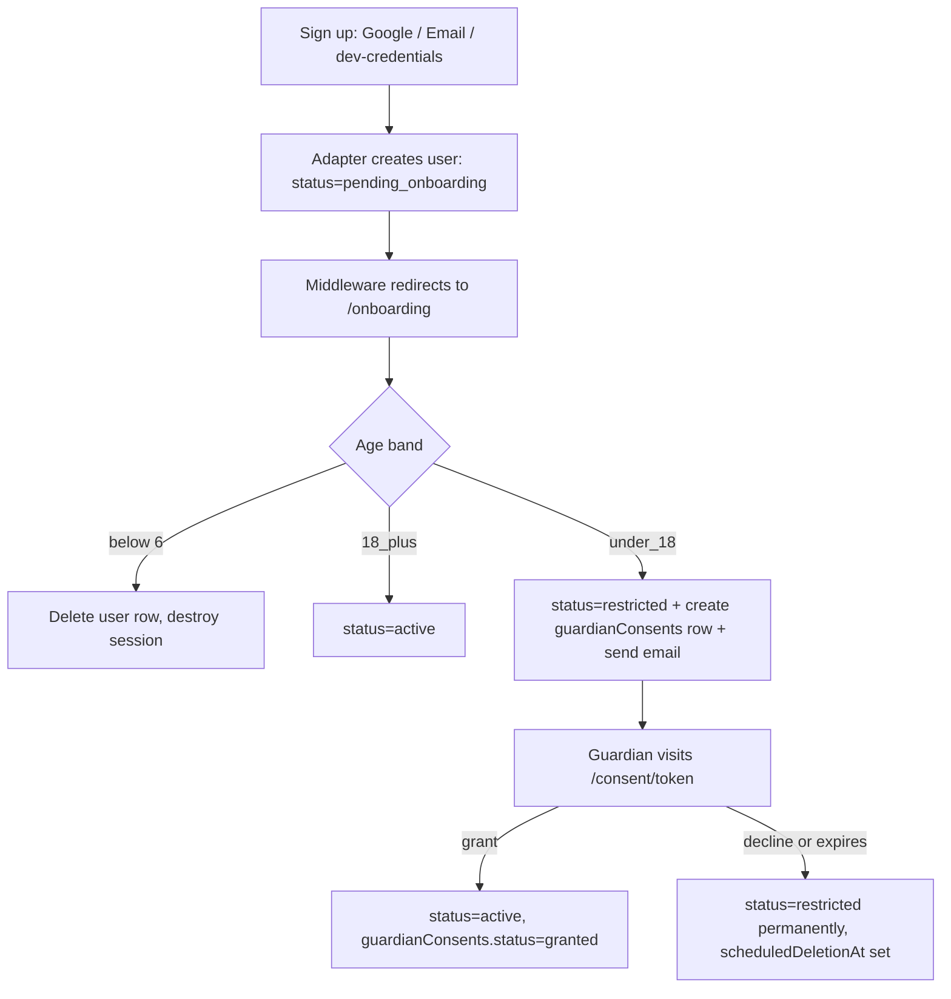

# Development Plan: US-001 & US-002 — Epic A: Identity, Access & Consent

**Date:** 2026-08-30
**Author:** Developer Agent
**Status:** Draft

---

## 1. Background & Context

Epic A is the foundation every other story depends on: nobody can author, publish, play, or review a quiz without an account. It covers two stories:

- **[US-001](../../working-artifacts/user-stories/language-learning-quiz-app/epic-a-identity-access-consent/us-001-sign-up-and-sign-in.md)** — sign-up/sign-in with an explicit role (tutor/learner) and a self-declared age band, backed by email or Google identity (DEC-10).
- **[US-002](../../working-artifacts/user-stories/language-learning-quiz-app/epic-a-identity-access-consent/us-002-guardian-consent-for-minors.md)** — a minor's account is restricted until a guardian confirms consent by email, and is auto-flagged for deletion after a 3-month retention window if consent is never granted (DEC-13).

**Current codebase state:** this is a fresh Next.js 16 / Auth.js v5-beta scaffold. `src/auth.ts` only wires a GitHub OAuth provider and the bare Auth.js Drizzle schema (`user`, `account`, `session`, `verificationToken`, `authenticator` — no domain fields at all). Only the shadcn `Button` component is installed. There is no middleware, no onboarding flow, and no non-auth domain tables yet.

**D-6 is still legally gating** (Legal hasn't signed off on the consent mechanism, DEC-12, or confirmed a jurisdiction-specific minor/adult age). Everything below implements the BA's working assumptions as **interim, reviewable code** — not a legal ruling. Two of those working assumptions were set by the Sponsor/user in this planning session (see §2) and should be revisited if Legal rules differently.

---

## 2. Design Decisions

| Decision | Choice | Rationale |
|----------|--------|-----------|
| Email delivery provider | **Resend**, via `next-auth/providers/resend` | API-key based (`RESEND_API_KEY`), no SMTP server to run; the provider does a raw `fetch` to Resend's API — no extra npm dependency needed |
| Guardian consent link expiry | **24 hours** | User decision; matches AC5's "configured window" |
| Retention purge (DEC-13) scope | **Flag only** — add a `scheduledDeletionAt` column and set it when consent is declined/expires; **no scheduler/cron is built this round** | User decision — keeps this epic focused on identity/consent UX; the actual purge job is a separate ops story |
| E2E auth strategy | Add a **dev/test-only Credentials provider**, registered only when `NODE_ENV !== 'production'` | User decision. Verified safe: Auth.js only forces JWT-only sessions when Credentials is the *sole* provider (`@auth/core/lib/utils/assert.js`); since Google + Resend are also configured, `session.strategy: 'database'` stays valid and every provider (including the test one) creates a real DB session |
| Google OAuth credentials | **Not available yet** — document `AUTH_GOOGLE_ID` / `AUTH_GOOGLE_SECRET` in `.env.example` only | User decision; the plan does not depend on having live credentials to be implementable/testable (the dev Credentials provider covers e2e) |
| UI components | Add missing pieces via the **shadcn CLI** (`Input`, `Label`, `RadioGroup`, `Select`, `Form`, `Alert`) | User decision; `components.json` is already configured for this |
| Age band scheme | **Two bands: `under_18` / `18_plus`** — `under_18` is "minor" and triggers the guardian-consent flow | User decision (overrides AS-001.3's illustrative three-band example) |
| Post-OAuth onboarding split | Account creation happens in **two steps**: Auth.js/adapter creates the bare `user` row on first successful sign-in (email verified or Google callback) with only identity fields; role, age band, and rights confirmation are collected on a **follow-up onboarding screen**, gated by middleware | Google and email-magic-link are both redirect/verification flows — neither lets us collect a form *before* the adapter persists the user. This is the only workable pattern with Auth.js's adapter lifecycle. **Risk:** flag to QA — AC1/AC3/AC5 read as if role/age/rejection happen in one atomic step; here they span two requests. See §6. |
| Restricted-account enforcement | **Not** a blanket middleware block. A shared `requireActiveAccount()` guard is called inside the specific server actions AC2 names: play/submit an attempt, save to a collection. Viewing your own account/status page and signing out are never blocked. | AC2 only lists those three actions; a full-site lockout would block things the story doesn't ask to block (e.g. seeing why you're restricted) |
| Below-minimum-age handling (AC5) | If declared age band would put the user under the global floor (age 6, DEC-9) — captured via a real date-of-birth-free "I am younger than 6" checkbox path, see Task 4 — the just-created adapter user row is **deleted** and the session destroyed, so "no account is created" holds even though Auth.js's adapter technically inserted a row first | Reconciles AC5's wording with the two-step onboarding split above |

---

## 3. Architecture / Approach

- **Layers touched:** DB schema (Drizzle), Auth.js config, new middleware, new server actions, new App Router pages (onboarding, consent-confirm), new shared auth-guard helpers, new shadcn UI components, Playwright e2e specs.
- **No new runtime dependencies** beyond what's already installed — Resend and Credentials are both shipped inside `next-auth`/`@auth/core`, which is already a dependency.
- **Session shape:** extend the Auth.js `session.user` via callbacks + a `types/next-auth.d.ts` module augmentation to carry `role`, `ageBand`, `status`, so every server component/action can read it straight off `auth()` without an extra query.
- **Data flow (sign-up):**
  1. Visitor picks a provider (Google / email link / dev-credentials-in-non-prod) → Auth.js adapter creates a bare `user` row (`status: 'pending_onboarding'`).
  2. Middleware sees `status === 'pending_onboarding'` on any non-onboarding route → redirects to `/onboarding`.
  3. `/onboarding` form collects role, age band, (if tutor) content-rights confirmation → one server action validates and either:
     - deletes the user row + destroys session (below age 6), or
     - sets `status: 'restricted'` and creates a `guardianConsents` row + sends the consent email (age band `under_18`), or
     - sets `status: 'active'` (age band `18_plus`).
  4. Guardian clicks the emailed link → `/consent/[token]` (public, no auth) → grant/decline → flips the minor's `status` to `active`/`restricted` (permanently) and records `scheduledDeletionAt` on decline/expiry.

---

## 4. Task Breakdown

### Task 1: Extend the schema and generate the migration
**Files to change:**
- `src/lib/db/schema.ts` — add columns to `users`: `role` (`pgEnum('user_role', ['tutor','learner'])`, nullable), `ageBand` (`pgEnum('age_band', ['under_18','18_plus'])`, nullable), `status` (`pgEnum('account_status', ['pending_onboarding','active','restricted','deleted'])`, default `'pending_onboarding'`), `contentRightsConfirmedAt` (nullable timestamp), `scheduledDeletionAt` (nullable timestamp). Add a new `guardianConsents` table: `id` (uuid pk), `userId` (fk → `users.id`, unique, cascade delete), `guardianEmail`, `tokenHash` (unique — store a SHA-256 hash, not the raw token), `status` (`pgEnum('consent_status', ['pending','granted','declined','expired'])`), `requestedAt`, `respondedAt` (nullable), `expiresAt`, `consentTextVersion`.

**What to do:**
- Follow the existing `pgTable` style already used in the file (see `sessions`/`accounts`).
- Run `npm run db:generate` then review the generated SQL before `npm run db:migrate`.

**Tests to write/update:**
- None (schema-only); covered indirectly by Task 4/6 tests.

---

### Task 2: Wire up Auth.js providers
**Files to change:**
- `src/auth.ts` — replace the `GitHub` provider with `Google`, `Resend`, and — only when `process.env.NODE_ENV !== 'production'` — a `Credentials` provider (`id: 'dev-test-login'`) that accepts an email and looks up/creates a user directly via `db`, for deterministic Playwright sign-in. Add a `session` callback that copies `role`, `ageBand`, `status` from the DB user onto `session.user`.
- `types/next-auth.d.ts` (new) — module augmentation adding `role`, `ageBand`, `status` to the `Session["user"]` and `User` types.
- `.env.example` — add `AUTH_GOOGLE_ID`, `AUTH_GOOGLE_SECRET`, `RESEND_API_KEY`, `EMAIL_FROM`; remove the now-unused `AUTH_GITHUB_ID`/`AUTH_GITHUB_SECRET` lines.

**What to do:**
- Keep `session: { strategy: 'database' }` — confirmed compatible (see §2 rationale).
- Gate the Credentials provider registration with a plain `if` when building the `providers` array so it's excluded from the production bundle's config object.

**Tests to write/update:**
- Unit: a small test (or manual check) that the `providers` array does **not** contain the dev-credentials provider when `NODE_ENV=production`.

---

### Task 3: Add missing shadcn/ui components
**Files to change:**
- Run the shadcn CLI to add `input`, `label`, `radio-group`, `select`, `form`, `alert` into `src/components/ui/`.

**What to do:**
- `npx shadcn@latest add input label radio-group select form alert` — verify each generated file compiles and follows the existing `button.tsx` conventions (imports from `@/lib/utils`, uses `cva`).

**Tests to write/update:**
- None — these are vendored primitives, not project logic.

---

### Task 4: Onboarding flow — role, age band, rights confirmation (US-001 AC1, AC3, AC4, AC5, AC7, AC8)
**Files to change:**
- `src/middleware.ts` (new) — for any authenticated request whose path isn't `/onboarding`, `/api/auth/*`, or a public route, redirect to `/onboarding` if `session.user.status === 'pending_onboarding'`.
- `src/app/onboarding/page.tsx` (new) — server component rendering the role/age-band/(conditional) rights-confirmation form using the new shadcn components.
- `src/app/onboarding/actions.ts` (new) — a server action `completeOnboarding(formData)` that:
  - Validates input with `zod` (role enum, age band enum, and — if role is `tutor` — a required `rightsConfirmed: true` boolean) at the action boundary, per repo convention.
  - Reads the current user via `auth()`.
  - If the age band selection indicates under-6 (a dedicated "I'm younger than 6" option in the form, not a real DOB field — keep it a self-declared band, per AS-001.2/AS-001.3), delete the `users` row and call `signOut()` (AC5).
  - Else sets `role`, `ageBand`, `contentRightsConfirmedAt` (tutor only, AC8).
  - If `ageBand === 'under_18'`: set `status = 'restricted'`, create a `guardianConsents` row (see Task 6), redirect to a "pending guardian consent" screen (AC1 of US-002).
  - Else: set `status = 'active'`, redirect to the user's home view.

**Tests to write/update:**
- Unit: `completeOnboarding` — happy path adult, happy path minor (creates consent row + restricted status), tutor rights confirmation required, under-6 deletes the account.
- E2E (Playwright, using the dev Credentials provider): AC1 (sign up → onboarding → home view), AC3 (submitting onboarding with no age band shows an error and does not create/activate the account), AC5 (declaring under-6 results in no account and an explanation), AC7 (sign-out ends the session and a protected page redirects back to sign-in).

---

### Task 5: Core authorization helpers (US-001 AC6, foundation for later epics)
**Files to change:**
- `src/lib/auth/guards.ts` (new) — `getCurrentUser()` (thin wrapper over `auth()`), `requireUser()` (throws/redirects if not signed in), `requireActiveAccount()` (throws/redirects if `status !== 'active'` — used by Task 4's minor-blocking and by future play/save actions).

**What to do:**
- These are the only sanctioned way for server actions/route handlers to check "who is this and are they allowed to act" — document this as the convention other epics must follow (private-by-default content per AC6 is enforced the same way once quiz ownership checks land in Epic B/C).

**Tests to write/update:**
- Unit: each guard's redirect/throw behavior for signed-out, pending-onboarding, restricted, and active users.

---

### Task 6: Guardian consent request (US-002 AC1)
**Files to change:**
- `src/lib/consent/request-consent.ts` (new) — `requestGuardianConsent(userId, guardianEmail)`: generates a random token, stores only its SHA-256 hash + `expiresAt = now + 24h` (per §2) in `guardianConsents`, and sends the email via a direct `fetch` to Resend's API (mirroring the pattern in `next-auth/providers/resend`) with a link to `/consent/<raw-token>`.
- Called from Task 4's `completeOnboarding` when `ageBand === 'under_18'`.

**Tests to write/update:**
- Unit: token is stored hashed (never the raw value), `expiresAt` is exactly 24h out, and the email payload contains the expected link shape. Mock the `fetch` call to Resend.

---

### Task 7: Guardian consent confirmation page (US-002 AC2, AC3, AC4, AC5)
**Files to change:**
- `src/app/consent/[token]/page.tsx` (new, public — no `auth()` call, this is the guardian, not the account holder) — looks up the hashed token, shows grant/decline buttons, or an "expired"/"already responded" message.
- `src/app/consent/[token]/actions.ts` (new) — `respondToConsent(token, decision)`:
  - `grant`: sets `guardianConsents.status = 'granted'`, `respondedAt = now`, flips `users.status = 'active'`.
  - `decline`: sets `guardianConsents.status = 'declined'`, `respondedAt = now`, `users.status` stays `'restricted'`, sets `users.scheduledDeletionAt = now + 3 months` (DEC-13, flag-only per §2).
  - Both mark the token single-use (re-visiting the same link after a decision shows the "already responded" state, not a re-vote — NFR: "single-use").
- A lazy expiry check (no cron): any read of a `guardianConsents` row past `expiresAt` and still `pending` is treated as `expired` on the fly, and sets `scheduledDeletionAt` the same way as decline (AC5).
- `src/app/(app)/consent-pending/page.tsx` (new) — the "pending consent" screen a restricted minor's own account lands on (AC1's "I am told that I must wait for guardian approval" + AC2's "shown the pending-consent message").

**Tests to write/update:**
- Unit: `respondToConsent` grant/decline transitions, expired-on-read behavior, single-use re-visit behavior.
- E2E: full minor journey — onboard as `under_18` → land on consent-pending screen → (test helper reads the raw token directly from the test DB, since email isn't actually sent to a real inbox in CI) → visit `/consent/<token>` → grant → minor can now sign in and see an active home view. Repeat for decline → minor stays restricted.

---

### Task 8: Minor privacy projection (US-002 AC6)
**Files to change:**
- `src/lib/users/public-profile.ts` (new) — `toPublicProfile(user)`: a single, shared serializer returning **only** `{ id, displayName }` (falls back to `name` truncated/aliased as the public display value) — never `email`, `image`, `ageBand`, or `role`. Every future epic that renders another user's identity publicly (catalogue cards, leaderboards, response lists) must go through this function.

**Tests to write/update:**
- Unit: given a full user row (including email/ageBand), asserts the output object has no keys beyond `id`/`displayName`.

---

### Task 9: Consent auditability for the website admin (US-002 AC7, DEC-14)
**Files to change:**
- `src/lib/consent/get-consent-audit.ts` (new) — `getConsentAudit(userId)`, callable only by a user whose own `role`/an `isAdmin` flag marks them as the website admin (reuse `requireUser()`; a full admin-role model is out of scope for this epic — add a single boolean `isAdmin` column on `users`, manually flipped via `db:studio` for now, and note that a real admin UI/role system is a follow-up story). Returns `{ status, requestedAt, respondedAt, guardianEmail, consentTextVersion }`.

**Tests to write/update:**
- Unit: non-admin caller is rejected; admin caller gets the full record.

---

### Task 10: `.env.example` and docs
**Files to change:**
- `.env.example` — final pass: `AUTH_GOOGLE_ID`, `AUTH_GOOGLE_SECRET`, `RESEND_API_KEY`, `EMAIL_FROM`, plus a comment noting the dev-only Credentials provider needs no configuration (auto-enabled off `NODE_ENV`).

**Tests to write/update:**
- None.

---

## 5. Files & References

| File | Why it's relevant |
|------|--------------------|
| [src/auth.ts](../../src/auth.ts) | Current Auth.js config to be extended (Task 2) |
| [src/lib/db/schema.ts](../../src/lib/db/schema.ts) | Existing Drizzle table conventions to follow (Task 1) |
| [src/lib/db/index.ts](../../src/lib/db/index.ts) | The only sanctioned `db` client import (repo rule) |
| [src/app/api/auth/[...nextauth]/route.ts](../../src/app/api/auth/%5B...nextauth%5D/route.ts) | Existing handler wiring — no change needed, confirm it still works after Task 2 |
| [components.json](../../components.json) | shadcn CLI config — confirm target paths before Task 3 |
| [e2e/smoke.spec.ts](../../e2e/smoke.spec.ts) | Existing Playwright pattern/config to follow for new specs |
| [US-001](../../working-artifacts/user-stories/language-learning-quiz-app/epic-a-identity-access-consent/us-001-sign-up-and-sign-in.md) | Full acceptance criteria for Task 4/5 |
| [US-002](../../working-artifacts/user-stories/language-learning-quiz-app/epic-a-identity-access-consent/us-002-guardian-consent-for-minors.md) | Full acceptance criteria for Task 6/7/8/9 |
| `@auth/core/lib/utils/assert.js` (node_modules) | Source of truth confirming Credentials + database-strategy compatibility (§2) |
| `@auth/core/providers/resend.js` (node_modules) | Pattern to mirror for the guardian-consent email (Task 6) |
| `.github/copilot-instructions.md` | Repo-wide rules this plan must honor (no client-side DB access, zod at boundaries, `auth()` for session reads, `@/lib/db` import) |

---

## 6. Risks & Unknowns

| Risk | Likelihood | Mitigation |
|------|------------|------------|
| Credentials provider + `session.strategy: 'database'` behaves differently than the static analysis in §2 suggests once actually exercised (e.g. adapter session row creation on credentials sign-in) | Medium | Spike Task 2 first in isolation with a throwaway Playwright test before building Tasks 4/7 on top of it |
| Two-step onboarding (adapter-created row → follow-up form) doesn't literally satisfy AC1/AC5's "one step" phrasing | Medium | Flagged in §2; raise with BA/QA during review — may need AC wording updated rather than code changed |
| D-6 is still open; the two-band age scheme and 24h consent window are working assumptions, not legal rulings | High (known, tracked) | Both are already logged as **this session's decisions** above; do not remove the "pending Legal" language from US-002 when this ships |
| Resend sandbox restrictions (unverified sending domain) could block real guardian emails outside of local dev | Medium | Document in `.env.example`/README that a verified Resend domain is required before any minor-facing environment goes live |
| No admin role system exists yet; Task 9's `isAdmin` boolean is a stopgap | Low | Explicitly scoped as a stopgap in Task 9; do not build more admin UI than the story requires |

---

## 7. How to Test Locally

1. Copy `.env.example` to `.env.local`; fill in `DATABASE_URL`, `AUTH_SECRET` (`npx auth secret`), `RESEND_API_KEY`, `EMAIL_FROM`. Google vars can stay empty in dev (the provider will simply not appear if unconfigured, or use the dev Credentials provider instead).
2. `npm run db:generate && npm run db:migrate` to apply the new schema.
3. `npm run dev`, visit `/`, sign in via the dev Credentials provider (non-prod only) with a test email.
4. Complete `/onboarding` as an adult (`18_plus`) → expect landing on the home view with `status: active`.
5. Repeat sign-up with a new test email, choose `under_18` at onboarding → expect redirect to `/consent-pending`. Check the `guardian_consents` table (via `npm run db:studio`) for the row and copy the raw token from server logs (dev-only logging of the link, since no real inbox exists locally) → visit `/consent/<token>` → grant → sign back in as the minor → expect `status: active`.
6. Repeat once more and decline the consent link → expect the minor account stays `restricted` and `scheduled_deletion_at` is set ~3 months out.
7. `npm run test:e2e` to run the new Playwright specs alongside the existing smoke test.

---

## 8. Definition of Done

- [ ] All acceptance criteria in US-001 (AC1–AC8) and US-002 (AC1–AC7) met
- [ ] Unit tests for guards, onboarding action, consent request/response, public-profile projection all passing
- [ ] Playwright e2e specs for sign-up, onboarding, minor-consent grant/decline passing alongside the existing smoke test
- [ ] No linting / type errors (`npm run lint`)
- [ ] `.env.example` updated with every new variable this epic introduces
- [ ] PR description links to this plan and calls out the two flagged risks in §6 (two-step onboarding, D-6 pending)
- [ ] Reviewed and approved by at least one peer
