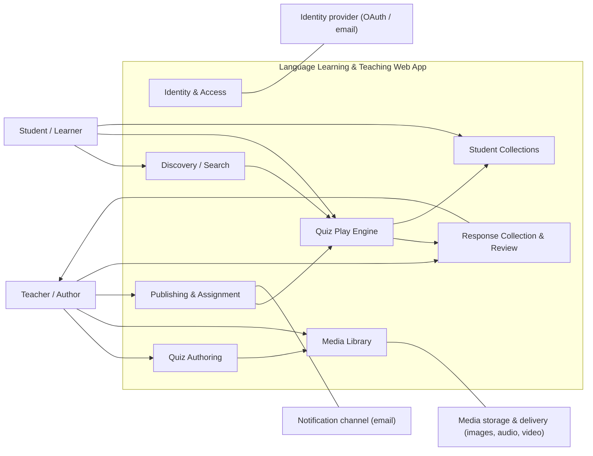

# Vision and Scope — Language Learning & Teaching Web App

| Field | Value |
| --- | --- |
| Project / Product | Language Learning & Teaching Web App (working name: **myapp1**) |
| Module / Process | Whole product (greenfield) |
| Purpose | Align stakeholders on business vision, users, high-level features, and scope boundary before SRS, user stories, and design |
| Audience | Sponsor, Product Owner, SME/Teacher representative, Delivery Manager, Solution Architect, QA Lead |
| Version / Date | v0.8 — 2026-08-30 |
| Author / Reviewer | BA Agent / *pending stakeholder review* |
| Status | **Draft — fifty-seven gating decisions confirmed; remaining items open** |
| Input mode | Greenfield |
| Overall confidence | **Medium.** Core scope questions (target customer, media direction, grading rule, minor status, publish model) are now confirmed. Business framing, success measures, and volumes remain *Inferred* or *Open*. |

### Source inputs

| # | Source | Type | Date | Reliability |
| --- | --- | --- | --- | --- |
| S1 | User request: teacher/student capability statement (quiz creation with MCQ, sentence re-arrange, flashcard; media upload; publish/assign; student play, response routed to author, personal collections) | Verbal/written brief | 2026-08-28 | Confirmed as stated intent, but not elaborated |
| S2 | Workspace technical baseline: Next.js App Router, React 19, TypeScript, Tailwind v4 + shadcn/ui, Neon Postgres + Drizzle ORM, Auth.js (NextAuth v5), Playwright, Vercel | Repo configuration (`copilot-instructions.md`, `package.json`) | 2026-08-28 | Confirmed (technical constraint) |
| S3 | Stakeholder decisions on Q2, Q4, Q6, Q7, Q12 and video priority (see Decision Log) | Stakeholder response | 2026-08-28 | **Confirmed** |
| S4 | Stakeholder change: no student list/roster — a quiz is distributed by shareable invitation link, and the QR code encodes that same link (revisits Q11) | Stakeholder response | 2026-08-30 | **Confirmed** |
| S5 | Stakeholder decision: joining via link/QR needs **no account** — a joiner enters a display name to play | Stakeholder response | 2026-08-30 | **Confirmed** |

### Decision log (S3)

| # | Question | Decision | Scope consequence |
| --- | --- | --- | --- |
| DEC-1 | Q6 — Does "input voice" include learner recording? | **No.** Teacher uploads audio only; students never record or upload audio. | F-20 dropped. Removes browser recording, per-attempt audio storage, and pronunciation review. **Reduces scope.** |
| DEC-2 | Q7 — Sentence re-arrangement grading rule | **Exactly one valid order.** Target content languages: **Chinese, Japanese, English**. | Grading logic becomes a simple sequence match, but CJK support introduces segmentation work — see F-23, R-5, Q7a/Q7b. **Net: neutral to increase.** |
| DEC-3 | Q4 — Are students minors? | **Yes — both minors and adults** will use the product. | Consent, age handling, retention, and safeguarding become **mandatory Phase 1 concerns**. **Increases scope.** |
| DEC-4 | Q2 — Target customer | **Independent tutors** (for now). | Confirms class/roster management, LMS integration, and institutional admin stay out of scope. **Reduces scope.** |
| DEC-5 | Q12 — Meaning of "publish" | **Fully public and discoverable.** | Public search/browse is in scope. Combined with DEC-3, moderation, reporting, and takedown become **mandatory**. **Increases scope.** |
| DEC-6 | F-08 video upload priority | **Confirmed as Should** for Phase 1. | Remains the primary trim candidate under timeline pressure. |
| **DEC-7** | Q11 — How are students identified for assignment? (S4) | **There is no roster or per-student targeting.** A quiz is distributed as a shareable invitation link; the QR code encodes that same link. Anyone holding the link can join. | Supersedes **A-4**. F-10 becomes "distribute via link/QR", not "assign to named students". **D-3 (email provider) is no longer required for distribution.** Removes "who has not started" reporting, since there is no predefined recipient list. **Net: reduces build (no roster/class management), but removes a reporting capability.** |
| **DEC-8** | Must a joiner have an account, or can they play with a nickname only? (S5) | **No account required.** A joiner enters a display name at join time; that name is what identifies their attempt. | Joining is frictionless, but the app has **no way to identify a minor** on this path, so the guardian-consent gate required by DEC-3/F-21 **cannot be technically enforced** here — see new **Issue I-3**. Response attribution is by self-reported name, not verified identity. **Increases legal/compliance risk.** |
| **DEC-9** | Q-001.1/Q4a (part) — Minimum age and operating jurisdictions | **Minimum age to hold any account is 6, applied globally** (the product operates in all jurisdictions, not a restricted launch list). This is the absolute floor only — guardian consent is still required for every minor as already defined by DEC-3 (a jurisdiction's own age of majority/digital-consent age, per the **Minor** glossary term), not replaced by this floor. | Closes AC5's threshold and Q4c's jurisdiction scope. **Does not remove the need to track each jurisdiction's own digital-consent age** — operating globally with a flat floor of 6 increases legal exposure (COPPA, GDPR-K, PIPL, APPI all differ); Legal must still confirm per-jurisdiction handling under D-6. |
| **DEC-10** | Q-001.2 — Identity providers for Phase 1 | **Email and Google OAuth.** | Closes D-2. Other providers (Apple, Microsoft, etc.) are deferred to Phase 2 if requested. |
| **DEC-11** | Q-001.3 — Role selection UX | **Role (tutor/learner) is chosen explicitly at sign-up**, not inferred from behaviour. | F-01's sign-up flow must present an explicit role choice; A-3 (one account can act as both) still holds — a user can still take on both roles later. |
| **DEC-12** | Q-002.1 — Guardian consent mechanism | **BA-recommended baseline: verifiable double-opt-in guardian email confirmation ("email-plus") — the guardian must click a consent link and actively confirm through a dedicated screen, not just open the email.** This is a working assumption to unblock design, **not a legal ruling**. | Partially closes D-6. **D-6 remains gating** until Legal confirms this is sufficient, or requires a higher-assurance method (signed form, payment verification, video call) given a global minimum age of 6. |
| **DEC-13** | Q-002.2/Q4c — Retention period | **3 months** for a restricted or declined minor account and its data, before deletion. | Closes Q4c. The data model needs a 3-month purge job for restricted/declined minor accounts. |
| **DEC-14** | Q-002.4 — Consent operations owner | **The website admin** (an internal ops role) is accountable for handling consent disputes and deletion requests — not Sponsor or Legal directly. | Operational ownership defined; access/tooling for the admin role must be built. |
| **DEC-15** | Q-002.5/Q16 — Consent requirement on the account-free join path | **Sponsor decision: guardian consent is NOT required for account-free link/QR joining (DEC-8/S5).** This is a risk-acceptance decision, not a legal clearance. | **Closes Issue I-3 as "risk accepted by Sponsor."** No consent gate will be built for that path; a minor of any age (including under the DEC-9 floor, since this path captures no age at all) can join anonymously. Residual regulatory exposure remains and is retained here for audit trail. |
| **DEC-16** | Q-003.1 — Maximum questions per quiz | **30 questions per quiz.** | US-003 needs a hard cap enforced on save; affects authoring UI and reorder/perf assumptions. |
| **DEC-17** | Q-003.2 — Author preview mode | **Required.** The author must be able to preview a quiz as a student would experience it, before publishing or sharing. | Adds a new AC to US-003; increases Phase 1 scope slightly but reduces published-quiz defect risk. |
| **DEC-18** | Q-004.1 — Partial credit for multi-answer MCQs | **Confirmed: no partial credit.** A multi-answer MCQ is scored all-or-nothing. | Confirms AS-004.3 as a settled rule rather than an assumption. |
| **DEC-19** | Q-004.2 — Maximum options per MCQ | **4 options maximum.** | US-004 needs an upper-bound validation to match the existing lower-bound (2) rule. |
| **DEC-20** | Q-005.1 — Japanese segmentation unit | **The word**, not the bunsetsu. | Sets the expected default/guidance for Japanese segment boundaries in US-005 and the CJK SME review under D-8; segments remain author-defined (A-10), this sets the target granularity to validate against. |
| **DEC-21** | Q-005.2 — Distractor segments | **Allowed, at the author's discretion** (an optional feature, not mandatory per question). | Reverses the prior "out of scope" note in US-005; grading must ignore segments not part of the correct sequence rather than reject them. |
| **DEC-22** | Q-005.3 — Punctuation handling in segments | **Punctuation is part of the segment it belongs to** (not stripped, not a separate segment). | Replaces AS-005.4's "author's discretion" wording with a fixed rule; affects segment-matching/grading logic and CJK test data (R-5). |
| **DEC-23** | Q-006.1 — Flashcard-only quizzes | **Allowed.** A quiz may contain flashcards only, with no scoring required. | Confirms/replaces AS-006.1's framing; [US-013](../../user-stories/language-learning-quiz-app/epic-d-discovery-play/us-013-play-quiz-and-submit-attempt.md) must handle an attempt with zero scorable questions without error. |
| **DEC-24** | Q-006.2 — Bulk flashcard import | **Confirmed nice-to-have** (Should/Could, Phase 2 candidate) — not required for Phase 1 launch. | No Phase 1 build impact; keep on the Phase 2 backlog. |
| **DEC-25** | Q-007.1 — Media formats and size cap | **Images:** usual web formats (JPEG, PNG, GIF, WebP). **Audio:** common formats (MP3, WAV, OGG) — *BA default, since only image formats were named explicitly; Sponsor should confirm audio formats.* **Size cap: 2MB per file**, for both images and audio. | Sets the validation rule for US-007 AC3/AC4. |
| **DEC-26** | Q-007.2 — Per-author quota | **Yes — 50 quizzes per author.** *Note: this answers with a quiz-count cap, not a media storage-size cap, which is what the underlying cost question (R-4-adjacent) was really probing. Recorded as given; Sponsor should confirm this is sufficient to bound storage/cost exposure, or a storage-size quota is still needed later.* | New AC in US-003 (quiz creation is blocked at 50); does not by itself cap total media storage per author. |
| **DEC-27** | Q-007.3 — Rights confirmation timing | **Once per account, at sign-up** — not re-asked on every upload. | Moves the rights-confirmation control from US-007 (per-upload) to US-001 (sign-up, tutor role); US-007's AC8 is rewritten accordingly. |
| **DEC-28** | US-008 (F-08 video upload) — Phase 1 scope | **Fully descoped.** Video upload will not be built in Phase 1 at all — this supersedes DEC-6 ("Should, first trim candidate"), which is now moot because there is nothing left to trim from; it was simply removed outright. | Closes R-4 (video cost risk — no longer applicable). US-008 is kept in the backlog, clearly marked **Descoped**, for audit trail rather than deleted. F-08 is removed from Phase 1 and Phase 2 scope. |
| **DEC-29** | Q-009.1 — Moderation owner | **The website admin** (same role as DEC-14) owns moderation. | Partially closes D-7 — owner is named; a response-time commitment is still undefined. |
| **DEC-30** | Q-009.2 — Unlisted visibility tier | **Yes, needed.** A quiz can be published as **Unlisted**: reachable by anyone holding its direct link, but not listed in public search/browse ([US-011](../../user-stories/language-learning-quiz-app/epic-d-discovery-play/us-011-find-a-quiz.md)). This sits alongside Draft and Public as a third visibility state. | New AC in US-009; AS-009.1 updated. |
| **DEC-31** | Q-009.3 — Public discovery timing | **Public discovery should follow seeded content**, not launch simultaneously with it. Link/QR sharing (DEC-7) remains the primary Phase 1 path; the public catalogue becomes valuable once quizzes exist to browse. | Confirms R-9's mitigation as an official decision rather than a proposed mitigation; supports the existing delivery-order sequencing (public catalogue in slice 4, after the core share/play loop). |
| **DEC-32** | Q-010.2 — Share link expiry | **No** — share links do not expire automatically; no default lifetime is applied. | Confirms AS-010.2's rotation model is the only way a link stops working (no time-based expiry to also build). |
| **DEC-33** | Q-010.3 — Human-readable join code | **Yes** — a short human-readable join code is provided alongside the link/QR, for devices that cannot scan. | New AC in US-010; accessibility improvement for non-camera devices. |
| **DEC-34** | Q-010.4 — Attempt/time limits per share | **No** — no attempt limits or time limits are required per share. | Confirms the existing out-of-scope note in US-010 as a settled decision, not just deferred. |
| **DEC-35** | Q-010.5 — Multiple concurrent links per quiz | **No** — a single active share link per quiz is sufficient; tutors teaching multiple groups do not get separate per-group links in Phase 1. | Confirms AS-010.2 (one active link at a time) as a settled decision, not just deferred. |
| **DEC-36** | Q-010.6 — Remedy for a leaked link | **No further remedy needed** beyond the link rotation and participant-removal controls already designed in US-010 (AC4, AC8). | No new build; confirms existing AC4/AC8 are considered sufficient. |
| **DEC-37** | Q-011.1 — Tags/topics for discovery | **No** — author-defined tags/topics are not required for discovery to be usable at launch. | Confirms AS-011.3 as a settled decision; [US-003](../../user-stories/language-learning-quiz-app/epic-b-quiz-authoring-media/us-003-create-and-manage-quiz-draft.md) does not need a tagging field in Phase 1. |
| **DEC-38** | Q-011.2 — Default browse order | **Most played**, with **newest** as the secondary order (used as a tiebreaker and for quizzes with no play history yet, so new content is still reachable). | Updates AS-011.2 and US-011's browse/sort behaviour. |
| **DEC-39** | Q-012.1/Q-013.1 — Retakes and which attempt counts | **Unlimited retakes are allowed; every attempt is recorded and all attempts are visible to the tutor** — there is no single "counted" attempt. | Removes the need for a retake cap or an attempt-selection rule in US-012/US-013/US-015. |
| **DEC-40** | Q-012.2 — Archiving completed entries | **Out of scope for Phase 1** — completed entries are not automatically archived out of the student's list. | No new build for US-012. |
| **DEC-41** | Q-012.3 — Post-play account-creation prompt | **Not needed** — no optional "create an account" step is offered to a joiner after playing. | AS-012.6's cross-device limitation stands without a mitigating prompt; a joiner who wants an account must sign up unprompted via [US-001](../../user-stories/language-learning-quiz-app/epic-a-identity-access-consent/us-001-sign-up-and-sign-in.md). |
| **DEC-42** | Q-013.2 — Post-submission visibility | **Only the score** is shown to the student after submitting — not the correct answers. | Updates AC1/AC2-family expectations in US-013; correct answers stay server-side only. |
| **DEC-43** | Q-013.3 — Can an anonymous visitor play a public-catalogue quiz without an account? | **No** — an anonymous visitor cannot play without an account; signing in is required for the public-catalogue path. This is distinct from the account-free link/QR join path (S5/DEC-8), which remains unchanged. | Closes X-1 for the discovery path; US-011/US-013 updated to require sign-in before play when a quiz was reached via public discovery. |
| **DEC-44** | Q-014.1 — Tutor visibility into flashcard review | **No** — flashcard review is entirely private practice; the tutor has no visibility into which students reviewed a set. | Confirms AS-014.1's framing; no reporting surface is built for flashcard review activity. |
| **DEC-45** | Q-014.2 — Shuffle for flashcard review | **No** — shuffle is not expected; cards remain in the author-defined order. | Confirms AS-014.2's default (author-defined order) and drops the "optional if cheap" shuffle candidate. |
| **DEC-46** | Q-015.1 — CSV export | **No** — CSV/spreadsheet export is not needed in Phase 1. | Confirms the existing out-of-scope note in US-015 as settled, not just deferred. |
| **DEC-47** | Q-015.2 — Written feedback to student | **No** — the tutor does not need to send written feedback back to a student in Phase 1. | Confirms the existing out-of-scope note in US-015 as settled; no new story is needed. |
| **DEC-48** | Q-015.3 — Attempt retention and account deletion | **Interpreted as: nothing changes automatically** — attempts are retained, and deleting a student's account does not cascade-delete the tutor's copy of their responses. *Note: BA interpretation of a terse "nothing" answer — Sponsor should confirm this reading.* The underlying question of how long attempts are retained overall remains open, tracked at X-6/D-6. | Confirms the tutor's response records are decoupled from the student's account lifecycle; general retention duration is still pending Legal (D-6). |
| **DEC-49** | Q-015.4 — "Who is missing" view | **No** — not expected. There is no defined roster to compare against (S4). | No new build; the tutor only ever sees who joined, never who did not. |
| **DEC-50** | Q-015.5 — Merge/relabel/split ambiguous nicknames | **No** — no merge, relabel, or split tool for ambiguous display names is needed. | Confirms AS-015.5's limitation stands as a known, accepted gap; no mitigating tool is built. |
| **DEC-51** | Q-016.1 — Tutor-side collections | **No** — tutors organising their own quizzes is a separate need, out of scope for US-016 (student collections). | No new build; a tutor-side organisation feature would be a separate future request. |
| **DEC-52** | Q-016.2 — Default "Saved" collection | **No** — there is no default collection; a student always names or chooses a collection when saving. | Confirms AC1/AC2 (US-016) as the only save paths; no one-click "quick save" shortcut is built. |
| **DEC-53** | Q-017.1 — Legally mandated report categories | **Descoped.** A dedicated formal legal/copyright notice channel is not built in Phase 1; the general reason categories already defined (AS-017.3) are used for all reports, including copyright claims. | Removes the need for a separate legal-notice intake flow; Legal should be aware copyright reports flow through the same general channel. |
| **DEC-54** | Q-017.2 — Reporter told outcome | **No** — the reporter is not notified of the outcome of their report. | Confirms AS-017.2 stands without an outcome-notification feature; no new build. |
| **DEC-55** | Q-018.1 — Operator role and response-time target | **The website admin** (confirms DEC-29) holds the operator role at launch, with a **2-business-day** target review turnaround. | **Fully closes D-7.** US-009, US-017, and US-018 are no longer gated by an undefined moderation owner or response time. |
| **DEC-56** | Q-018.2 — Author appeals process | **No** — an author appeals process is not legally required for Phase 1. | Confirms the existing out-of-scope note in US-018 as settled. |
| **DEC-57** | Q-018.3 — Hard delete vs. unpublish | **Unpublishing is sufficient** — taken-down content does not need to be hard-deleted. | Confirms AS-018.2 as a settled rule rather than an assumption. |

### Missing material (blocks higher confidence)

- No business case, budget, funding model, or target launch date.
- No named stakeholders or decision owner.
- No user volume or media size expectations.
- No competitor/alternative analysis (Quizlet, Kahoot!, Quizizz, Wordwall, Duolingo, Google Forms/Classroom).
- No jurisdiction list for the minor-user compliance obligations created by DEC-3.

---

## 1. Introduction

### 1.1 Purpose

This document defines the business vision, target users, product boundary, and high-level feature set for a web application that lets **teachers author interactive language-learning quizzes** and **students discover, play, and organize them**, with student responses routed back to the quiz author.

It is deliberately high level. It does **not** contain acceptance criteria, screen specs, data models, or API contracts — those belong in the downstream functional decomposition, SRS, and user stories.

### 1.2 Document scope

| In this document | Not in this document |
| --- | --- |
| Business opportunity, problem, positioning | Detailed functional requirements / acceptance criteria |
| Stakeholders, user profiles, user environment | Screen designs, wireframes, design system |
| Product context, modules, external interfaces | Data model, API specification, migration plan |
| Feature list with priority (MoSCoW) and benefit | Sprint plan, estimates, team composition |
| Scope in/out, phasing, assumptions, risks | Test cases and automation strategy |

### 1.3 References

- S1, S2 above.
- Downstream artifacts to be produced: functional decomposition → user stories → wireframes → test strategy.

---

## 2. Positioning

### 2.1 Business opportunity — *Inferred*

Language teachers spend a disproportionate share of preparation time building and grading practice material. Existing general-purpose quiz tools (form builders, generic quiz apps) are not shaped around **language pedagogy**: they under-serve sentence construction/word-order practice, vocabulary retention through flashcards, and listening/pronunciation drills that require audio and video. Teachers therefore stitch together several tools — a form builder for questions, a flashcard app for vocabulary, a messaging channel for assignment and results — and lose a consolidated view of learner performance.

The opportunity is a single, language-first authoring and practice platform where a teacher can build media-rich, language-specific exercise types once, assign them, and receive learner responses in one place.

The initial target is the **independent tutor** (DEC-4): a teacher who works without institutional IT support, owns their own material, and has no LMS to fall back on — and therefore feels the tool-fragmentation cost most directly.

> **Open:** Whether this opportunity is validated by real teacher demand remains unconfirmed. See §9 Q1, Q3.

### 2.2 Problem statement — *Inferred*

| Element | Statement |
| --- | --- |
| **The problem of** | Fragmented, time-consuming creation and distribution of language practice exercises, and the manual effort of collecting and reviewing learner responses |
| **affects** | Language teachers/tutors and their students |
| **the impact of which is** | Preparation time diverted from teaching; inconsistent practice material; delayed or lost feedback to learners; no consolidated view of who practised what and how they performed |
| **a successful solution would** | Let a teacher author media-rich, language-specific exercises in minutes, publish or share them in one action, and see learner responses automatically collected against the exercise — while giving students a low-friction way to find, play, and re-practise material they care about |

### 2.3 Product position statement — *Inferred*

| Element | Statement |
| --- | --- |
| **For** | **Independent language tutors** and the students they teach |
| **Who** | need to create, distribute, and practise language exercises with audio, video, and images, without institutional IT or an LMS |
| **The** *(product)* | Language Learning & Teaching Web App |
| **Is a** | web-based quiz authoring and practice platform |
| **That** | supports language-specific exercise types (multiple choice, sentence re-arrangement, flashcards) with rich media, one-step publish/share, and automatic response collection back to the author |
| **Unlike** | general quiz/form builders and consumer flashcard apps, which either lack language-specific exercise types or lack a teacher-owned distribution-and-response loop |
| **Our product** | combines language-oriented exercise types, media support, and the teach → share → respond → review loop in a single tool |

> **Open:** Differentiation claim is unverified — no competitor analysis has been performed. Confirm before using externally. See §9 Q3.

### 2.4 Business objectives and success measures — *Inferred; targets are placeholders*

| ID | Objective | Candidate measure | Target |
| --- | --- | --- | --- |
| BO-1 | Reduce teacher effort to produce a ready-to-share exercise set | Median time from "create quiz" to "published/shared" | *TBD* (e.g. < 15 min for a 10-question quiz) |
| BO-2 | Close the feedback loop between distribution and response | % of shares with at least one collected response within 7 days | *TBD* |
| BO-3 | Drive repeat student practice | % of students who play ≥ 2 quizzes within 30 days | *TBD* |
| BO-4 | Establish an authoring content base | Number of published quizzes per active teacher per month | *TBD* |
| BO-5 | Validate product-market fit before scaling | Teacher retention at 30 days | *TBD* |

> **Action:** Sponsor must set targets. Without them, "successful delivery" is undefined and Phase 1 cannot be evaluated.

---

## 3. Stakeholder and User Description

### 3.1 Stakeholder summary — *Inferred; names required*

| Stakeholder | Represents | Key interest | Decision rights |
| --- | --- | --- | --- |
| Sponsor / Product Owner | Funding + product direction | Scope, priority, release goal | **Final scope and release decisions** |
| Teacher SME | Authoring users | Pedagogical fit of exercise types | Advisory on exercise behavior and grading rules |
| CJK language SME | Chinese/Japanese content correctness | Sentence segmentation and grading validity (DEC-2) | Advisory on segmentation rules |
| Student representative | Learning users | Ease of discovery and play | Advisory on UX |
| Parent / guardian *(minor users)* | Minor learners | Consent, safety, data use | Consent grant (DEC-3) |
| Delivery Manager | Delivery team | Feasibility, timeline, risk | Delivery approach |
| Solution Architect | Technical stack | Media storage, scalability, auth model | Technical design |
| QA Lead | Quality | Testability of exercise types and grading | Quality gates |
| Data protection advisor | Compliance | Minor data, consent, retention, public content safety | **Compliance sign-off — now mandatory (DEC-3 + DEC-5)** |

> **Open:** No decision owner is currently named. This is a scope-creep risk (§7 R-1).

### 3.2 User profiles

| Attribute | **Teacher / Author** | **Student / Learner** |
| --- | --- | --- |
| Technical background | Non-technical to moderately technical; comfortable with web tools, not with configuration | Varies widely; may be a child, teen, or adult |
| Sophistication | Domain expert in language teaching; novice in edtech tooling | Novice; expects consumer-app simplicity |
| Responsibilities | Author quizzes, attach media, publish or assign, review responses | Find quizzes, play them, save favorites into collections |
| Success definition | "I built and sent a quiz quickly, and I can see who answered what" | "I found something useful, playing it was easy, and I can come back to it" |
| Pain points today | Tool switching, manual distribution, manual collation of answers | Scattered links, no single place for their practice material |
| Frequency of use | Weekly to daily during term | Several times per week, short sessions |
| Age | Adult | **Mixed: minors and adults (DEC-3)** — the product must handle both |

> **Confirmed (DEC-3):** the student population includes **minors**. The product must therefore support age-appropriate account creation, guardian consent where required, restricted exposure of minors' personal data in a publicly discoverable environment (DEC-5), and defined data retention/deletion. This is a compliance gate, not a feature preference — see §7 I-1 and §9 Q4a–Q4c.

### 3.3 User environment — *Inferred*

- **Devices:** Desktop/laptop for authoring (media upload, longer sessions); mobile and tablet heavily used for playing. Responsive web is expected; native apps are out of scope.
- **Connectivity:** Assumed online-only. Offline play is out of scope for Phase 1.
- **Task cycle:** Teacher authors in a preparation burst (evenings/weekends); students play in short bursts, often just before class or on assignment deadline.
- **Existing systems:** Independent tutors typically have **no LMS** (DEC-4); they rely on messaging apps, email, and consumer tools. Integration is out of scope and is a lower future priority than previously assumed.
- **Content languages:** Chinese, Japanese, English (DEC-2). Requires correct rendering, fonts, and IME input for CJK scripts.
- **Volume:** Unknown. Needed to size media storage/bandwidth. See §9 Q5.

---

## 4. Product Overview

### 4.1 Product context

### 4.2 Main modules / capabilities

| Module | Purpose |
| --- | --- |
| M1 — Identity & Access | Sign-up/sign-in, teacher vs student role, ownership of content |
| M2 — Quiz Authoring | Create/edit a quiz and its questions across supported question types |
| M3 — Media Library | Upload, store, and attach images, audio, and video to questions |
| M4 — Publishing & Assignment | Make a quiz publicly playable, or distribute it via a shareable invitation link/QR code (**DEC-7** — no roster or per-student targeting) |
| M5 — Discovery | Public search/browse of published quizzes, plus the quizzes a student has joined via link/QR (DEC-5, **DEC-7**) |
| M6 — Quiz Play Engine | Render and run each question type, capture answers, score the attempt |
| M7 — Response Collection & Review | Route submitted attempts to the quiz author and present them for review |
| M8 — Student Collections | Let a student save/organize quizzes into personal collections |
| M9 — Trust & Safety | Age/consent handling, content reporting, moderation and takedown for publicly discoverable content (DEC-3 + DEC-5) |

### 4.3 External systems / interfaces

| Interface | Purpose | Phase | Confidence |
| --- | --- | --- | --- |
| Identity provider (OAuth and/or email) | Authentication | 1 | **Confirmed: email + Google (DEC-10)** |
| Object storage + CDN for media | Store/serve images, audio, video | 1 | Inferred — provider not chosen |
| Email/notification service | Response notifications (Phase 2, F-17); **no longer needed for distribution itself — DEC-7 replaced invitations with a shareable link** | 1 or 2 | Open |
| LMS (Google Classroom, Moodle, Teams) | Roster sync, grade passback | Future | Open |
| Speech/pronunciation scoring service | Automated speaking assessment | Future | Out of scope |

### 4.4 Key data domains

User & role · Quiz · Question (typed) · Media asset · Publication/Assignment · Attempt & Response · Collection.

---

## 5. Product Features

Priority uses MoSCoW for **Phase 1 (MVP)**. Every feature traces to a source and a benefit.

| ID | Feature | Description (high level) | End-user benefit | Priority | Source |
| --- | --- | --- | --- | --- | --- |
| F-01 | Account & role | Users sign up/in; a user acts as teacher (author) and/or student | Content ownership and response routing are trustworthy | **Must** | Inferred (prerequisite of S1) |
| F-02 | Create & manage quiz | Author creates a quiz, adds/orders/edits/deletes questions, saves as draft | Teacher builds and refines material in one place | **Must** | S1 |
| F-03 | Multiple-choice question | Question with selectable options and defined correct answer(s) | Fast comprehension and vocabulary checking | **Must** | S1 |
| F-04 | Sentence re-arrangement question | Learner orders shuffled words/segments into a correct sentence | Targets word order and grammar — a core language skill generic tools handle poorly | **Must** | S1 |
| F-05 | Flashcard | Two-sided card (prompt/answer) played in a review flow | Supports vocabulary memorization | **Must** | S1 |
| F-06 | Attach image to a question | Upload/attach an image to a question or option | Visual vocabulary and context cues | **Must** | S1 |
| F-07 | Attach audio/voice to a question | Upload/attach an audio clip | Enables listening comprehension and pronunciation modelling | **Must** | S1 |
| ~~F-08~~ | ~~Attach video to a question~~ | ~~Upload/attach a video clip~~ | — | **Dropped (DEC-28)** | Closed: fully descoped for Phase 1, superseding DEC-6's earlier "Should" priority |
| F-09 | Publish a quiz publicly | Make a quiz publicly discoverable and playable by any user | Reach beyond a shared link's holders; builds the shared content base | **Must** | S1, DEC-5 |
| F-10 | Distribute a quiz via invitation link or QR code | Anyone holding the link (or scanning the QR code) can join and play, with an optional due date; **no roster, no per-student targeting, no account required to join (DEC-7, DEC-8)** | Frictionless distribution with no list to build or maintain | **Must** | S1, **DEC-7, DEC-8** |
| F-11 | Find a quiz | Student searches/browses the public quiz catalogue, and finds the quizzes they have joined via link/QR | Low-friction access to relevant practice | **Must** | S1, DEC-5, **DEC-7** |
| F-12 | Play a quiz | Student answers questions with media playback and sees a result | The core learning experience | **Must** | S1 |
| F-13 | Submit & route responses | Attempt data is captured and made available to the quiz author | Closes the teach → practise → feedback loop | **Must** | S1 |
| F-14 | Author response review | Author views attempts/answers per quiz and per student | Teacher sees who answered what without manual collation | **Must** | S1 |
| F-15 | Student collections | Student saves quizzes into named personal collections | Learner-owned study library encourages repeat practice | **Must** | S1 |
| F-16 | Auto-scoring for objective questions | System scores MCQ and sentence re-arrangement automatically | Removes manual grading effort | **Should** | Inferred from F-13/F-14 |
| F-17 | Distribution/response notification | Notify a joiner of a new shared quiz (if contactable) and/or notify the author of a response | Keeps the loop timely without manual chasing | **Should** | Inferred from S1 "receive response"; **contactability of joiners is now uncertain post-DEC-7/DEC-8 — see Q11 (closed) and Q16** |
| F-18 | Duplicate / reuse a quiz | Copy an existing quiz as a starting point | Reduces repeat authoring effort term over term | **Could** | Inferred (BO-1) |
| F-19 | Basic quiz analytics | Aggregate per-question accuracy across attempts | Teacher identifies what the class did not understand | **Could** | Inferred (BO-2) |
| **F-21** | **Age & consent handling** | Capture age band at sign-up; apply guardian-consent path and restricted data handling for minors | Lawful, safe participation of minor learners | **Must** | DEC-3 |
| **F-22** | **Content reporting & takedown** | Any user can report a public quiz; author/operator can unpublish or remove it | Keeps a publicly discoverable catalogue safe for minors and rights-compliant | **Must** | DEC-3 + DEC-5 |
| **F-23** | **CJK-aware sentence segmentation** | Author defines the orderable segments for a sentence question (explicit for Chinese/Japanese, which lack word spacing) | Sentence re-arrangement works correctly in all three target languages | **Must** | DEC-2 |
| ~~F-20~~ | ~~Voice recording by learner~~ | ~~Learner records spoken response in-app~~ | — | **Dropped (DEC-1)** | Closed: teacher-upload audio only |

> **DEC-1 resolved:** *"I can input image/video/voice for my quizz"* means **teacher-side media upload only**. Learners never record or upload audio. F-20 is removed from scope; browser audio capture, per-attempt audio storage, and pronunciation review are out.

> **DEC-2 consequence (F-23):** with **exactly one valid order**, grading is a straight sequence comparison — simple. The real work is *defining the segments*. English can default to splitting on spaces, but **Chinese and Japanese have no word delimiters**, so segments must be author-defined rather than machine-guessed. Treat F-23 as a first-class feature, not a detail of F-04.

---

## 6. Scope

### 6.1 In scope — Phase 1 (MVP)

- Teacher and student accounts with content ownership, including **age band capture and guardian-consent handling for minors** (F-01, F-21).
- Quiz authoring with three question types: multiple choice, sentence re-arrangement, flashcard (F-02 – F-05).
- **Author-defined sentence segmentation supporting Chinese, Japanese, and English content** (F-23).
- Teacher-uploaded media on questions: image and audio required (F-06, F-07). **Video (F-08) is fully descoped for Phase 1 — DEC-28. Learner-side audio recording is excluded.**
- **Public** publishing and link/QR distribution (F-09, F-10 — **DEC-7**, no roster or assignment list).
- Public discovery, play, and submission (F-11 – F-13).
- Author-side response review with automatic scoring of objective question types (F-14, F-16).
- Student-owned quiz collections (F-15).
- **Content reporting and takedown for public quizzes** (F-22).
- Responsive web app usable on desktop, tablet, and mobile browsers.

### 6.2 Out of scope — Phase 1

| Item | Rationale |
| --- | --- |
| Native iOS/Android apps | Responsive web covers Phase 1 reach |
| Offline play / sync | Adds significant complexity; assumed online-only |
| Live/synchronous classroom game mode (Kahoot-style) | Distinct product mode; not implied by S1 |
| LMS integration and grade passback | No confirmed institutional requirement yet |
| Payments, subscriptions, marketplace monetization | No business model confirmed |
| **Learner voice recording / submission** | **Closed by DEC-1** — teacher-uploaded audio only |
| Automated pronunciation/speech scoring | Requires third-party AI service; unbudgeted; also moot given DEC-1 |
| AI-generated quiz content | Not requested |
| Class/roster management, institutional admin, LMS integration | **Closed by DEC-4** — target is independent tutors |
| Multiple accepted answer orders for sentence questions | **Closed by DEC-2** — exactly one valid order |
| Automatic word segmentation for Chinese/Japanese | Author defines segments (F-23); automated tokenization is a future optimization |
| Multi-language UI (localization of the app itself) | Content is multilingual (zh/ja/en); the interface is assumed single-language for Phase 1 — see Q14a |
| Proactive/automated content moderation (pre-publication screening) | Phase 1 is **reactive**: report + takedown (F-22). Proactive screening deferred |
| Accessibility certification (formal WCAG audit) | Baseline accessibility is expected; formal audit is a separate engagement |

### 6.3 Phasing (indicative)

| Phase | Theme | Contents |
| --- | --- | --- |
| **Phase 1 — MVP** | Prove the author → publish/assign → respond loop, safely | F-01 – F-07, F-09 – F-16, **F-21, F-22, F-23** |
| **Phase 2** | Reduce friction and increase repeat use | F-17, F-18, F-19, richer collections. **F-08 removed — fully descoped, not deferred (DEC-28).** |
| **Phase 3 (candidate)** | Reach and productivity | Automated CJK segmentation assist, proactive moderation, live mode, monetization |

> Phasing is a BA proposal, not a commitment. Requires Sponsor confirmation.

---

## 7. Assumptions, Dependencies, Constraints, Risks

### 7.1 Assumptions — *all require client validation*

| ID | Assumption | Impact if wrong | Validation owner |
| --- | --- | --- | --- |
| ~~A-1~~ | ~~"Voice" means teacher-uploaded audio~~ | — | **Closed — confirmed by DEC-1** |
| ~~A-2~~ | ~~Students are adults; no minor-consent workflow needed~~ | — | **Closed — DEC-3 confirms the opposite; now Issue I-1** |
| A-3 | One user account can act as both teacher and student | Auth and permission model rework | Product Owner |
| ~~A-4~~ | ~~Assignment targets individual students (and simple ad-hoc groups)~~ | — | **Closed — superseded by DEC-7 (link/QR distribution; no roster or per-student targeting)** |
| A-5 | Objective questions are auto-scored; flashcards are practice-only (no score) | Response review and analytics design changes | Teacher SME |
| A-6 | The app UI is delivered in a single language, even though content is zh/ja/en | Localization effort added | Product Owner |
| A-7 | Media is teacher-supplied and rights-cleared by the teacher | Copyright exposure — **now higher given public discoverability (DEC-5)** | Legal |
| A-8 | Online-only usage is acceptable | Offline architecture required | Product Owner |
| A-9 | Media file sizes are modest (short clips, not long-form video) | Storage/bandwidth cost and upload architecture change | Solution Architect |
| **A-10** | Sentence segments are defined by the **author at authoring time** for all three languages (F-23) | If auto-segmentation is expected instead, a tokenization library/service is required for zh/ja | Teacher SME / CJK SME |
| **A-11** | Age is **self-declared** at sign-up; no identity or age verification service is used | Verification vendor cost and flow added | Sponsor / Legal |
| **A-12** | Minors' publicly visible presence is limited to a display name; real names, email, and response data are never public | Privacy exposure; potential regulatory breach | Data protection advisor |
| **A-13** | Moderation in Phase 1 is **reactive** (report → review → takedown), not pre-publication screening | Proactive screening cost and latency added to the publish flow | Product Owner |
| **A-14** | A joiner needs **no account**; a self-entered display name is sufficient to attribute a response for that session (**DEC-8**) | Response attribution is only as reliable as the name typed, and the minor-consent gate (F-21) cannot be applied on this path — see **Issue I-3** | Sponsor / Legal |

### 7.2 Dependencies

| ID | Dependency | Owner | Needed by |
| --- | --- | --- | --- |
| D-1 | Media storage/CDN provider selected and provisioned | Solution Architect | **Before F-06 – F-07 development** *(F-08 no longer applies — descoped, DEC-28)* |
| ~~D-2~~ | ~~Identity provider(s) chosen (OAuth providers and/or email)~~ | Solution Architect / PO | **Resolved (DEC-10): email + Google** |
| D-3 | Email/notification provider | Solution Architect | Before F-17 — **no longer required for F-10 distribution (superseded by DEC-7); relevant only if F-17 notifications (Phase 2) are built** |
| D-4 | Teacher SME available for exercise-type and grading rules | Sponsor | Before functional decomposition |
| D-5 | Success measure targets set (BO-1 – BO-5) | Sponsor | Before Phase 1 sign-off criteria |
| **D-6** | **Legal/privacy advice on minor users** in the target jurisdictions: minimum age and retention are now set (DEC-9, DEC-13); **Legal sign-off on the BA-recommended consent mechanism (DEC-12) is what remains** | Sponsor / Legal | **Before F-01/F-21 design — still gating** |
| ~~D-7~~ | ~~Moderation operating model: owner confirmed as the website admin (DEC-29); response time still undefined~~ | Sponsor | **Resolved (DEC-55): owner = website admin, 2-business-day review target. Closed.** |
| **D-8** | CJK SME to validate segmentation and grading behaviour for Chinese and Japanese | Sponsor | Before F-04/F-23 build |

### 7.3 Constraints

| ID | Constraint | Type |
| --- | --- | --- |
| C-1 | Technical stack fixed: Next.js App Router + React 19 + TypeScript, Tailwind v4 + shadcn/ui, Neon Postgres via Drizzle ORM, Auth.js v5, Playwright, Vercel | Technical (Confirmed, S2) |
| C-2 | Serverless deployment model — long-running media processing must be handled outside request handlers | Technical (Inferred from S2) |
| C-3 | Postgres is the system of record; binary media must live in object storage, not the database | Technical (Inferred) |
| C-4 | Budget and timeline undefined | Commercial (Open) |
| **C-5** | Product must correctly handle **CJK text**: rendering, fonts, IME input, and character-level (not space-based) segmentation | Technical (Confirmed, DEC-2) |
| **C-6** | Product must comply with **minor-data protection obligations** in its operating jurisdictions | Legal (Confirmed, DEC-3) |

### 7.4 Risks

**Issues** — risks that DEC-3 and DEC-5 have made certain rather than probabilistic:

| ID | Issue | Impact | Action |
| --- | --- | --- | --- |
| **I-1** | **Minors are confirmed users (DEC-3).** Guardian consent, minimum-age rules, data retention/deletion, and restricted public exposure of minors' data are now legal obligations, not options. | **High — can block launch** | Close D-6 before designing F-01/F-21. Treat as a release gate. |
| **I-2** | **Public discoverability + minor users (DEC-5 + DEC-3).** A publicly browsable catalogue authored by unvetted independent tutors and consumed by minors creates safeguarding, inappropriate-content, and copyright exposure. | **High** | Ship F-22 (report + takedown) with F-09. **D-7 closed (DEC-55): website admin owns moderation, 2-business-day review target.** |
| ~~I-3~~ | ~~Account-free join (DEC-8) + minors are confirmed users (DEC-3). Joining by link/QR needs no account, so the app has no way to identify a minor or apply the guardian-consent gate (F-21) on this path.~~ | — | **Resolved (DEC-15): Sponsor accepts this as risk — no consent gate will be built for the account-free join path. Retained here for audit trail, not an open blocker.** |

**Risks:**

| ID | Risk | Impact | Likelihood | Mitigation |
| --- | --- | --- | --- | --- |
| R-1 | No named decision owner → unresolved scope questions stall delivery | High | High | Sponsor names a single Product Owner before decomposition |
| ~~R-2~~ | ~~Learner voice recording expected~~ | — | — | **Closed by DEC-1** |
| ~~R-3~~ | ~~Students may be minors~~ | — | — | **Realized — promoted to Issue I-1** |
| R-4 | ~~Video upload/storage/streaming cost and complexity underestimated~~ | — | — | **Closed (DEC-28): F-08 video upload is fully descoped for Phase 1; the risk no longer applies.** |
| R-5 | **CJK segmentation is mis-specified.** Chinese and Japanese have no word spaces, so "one valid order" is only meaningful once segments are defined; ambiguity here breaks the core exercise type in 2 of 3 target languages | **High** | **High** | Close D-8; specify F-23 explicitly before build; add zh/ja test data early |
| R-6 | No competitor analysis → weak differentiation, wasted build | Medium | Medium | Run a short competitive scan before Phase 2 commitment |
| ~~R-7~~ | ~~Public discovery may invite inappropriate content~~ | — | — | **Realized — promoted to Issue I-2** |
| R-8 | Success measures undefined → "done" is unverifiable | Medium | High | Close D-5 |
| **R-9** | Public catalogue launches empty (cold start) → discovery delivers no value to early students | Medium | High | **Confirmed (DEC-31):** seed content with early tutors; link/QR distribution (DEC-7) is the primary Phase 1 path, discovery follows once seeded |
| **R-10** | Trust & safety scope (F-21, F-22) was not in the original brief and may not be budgeted | Medium | Medium | Sponsor confirms budget/timeline impact before Phase 1 commitment |

---

## 8. Other Requirements (themes, not specifications)

| Area | Theme | Status |
| --- | --- | --- |
| Security | Authenticated access; users may only read/modify their own content; responses visible only to the quiz author and the responding student; server-side authorization on every data access. **Public quizzes are readable anonymously; responses never are.** | Expected — detail in SRS |
| Privacy | Learner response data is personal data. **Minors are in scope (DEC-3)**, so consent basis, minimum age, retention, export, and deletion must be explicitly defined. Minors' identity must not be exposed in the public catalogue. **The account-free link/QR join path (DEC-8) cannot enforce this consent requirement at all — see Issue I-3.** | **Mandatory — blocked on D-6; I-3 unresolved** |
| Performance | Quiz play should feel instant; media should begin playback quickly on mobile networks | Targets **TBD** |
| Accessibility | Keyboard operability, captions/transcripts for audio-video, sufficient contrast; drag-based sentence re-arrangement needs a non-drag alternative | Baseline expected; formal audit out of scope |
| Internationalization | Correct storage, rendering, fonts, and IME input for Chinese, Japanese, and English content; character-aware (not space-based) text handling | **Mandatory (DEC-2)** |
| Reporting | Per-quiz and per-student response views in Phase 1; aggregate analytics from Phase 2 | Confirmed direction |
| Content rights | Teachers warrant they hold rights to uploaded media; **a takedown path is required** because publishing is fully public | **Mandatory (DEC-5)** — F-22 |
| Trust & safety | Report mechanism, review workflow, unpublish/remove, and repeat-offender handling for public content | **Mandatory (I-2)** — **D-7 resolved (DEC-55): website admin, 2-business-day target** |
| Support & operations | Media storage growth monitoring; moderation queue operations | **Owner and response time confirmed (DEC-55); D-7 closed** |
| Standards | Minor-data protection regime(s) to be identified per operating jurisdiction | **Open — D-6** |

---

## 9. Open Questions and Decisions Needed

### 9.1 Closed

| # | Question | Resolution |
| --- | --- | --- |
| Q2 | Target customer | **Independent tutors** (DEC-4) |
| Q4 | Are students minors? | **Yes — minors and adults** (DEC-3). Jurisdictions still needed → Q4a |
| Q6 | Does "input voice" include learner recording? | **No — teacher upload only** (DEC-1) |
| Q7 | Sentence re-arrangement grading rule | **One valid order**; languages zh/ja/en (DEC-2). Sub-questions remain → Q7a, Q7b |
| Q12 | Meaning of "publish" | **Fully public and discoverable** (DEC-5) |
| ~~—~~ | ~~F-08 video priority~~ | **Superseded (DEC-28): F-08 is fully descoped for Phase 1, not just deprioritised as DEC-6 originally said** |
| Q11 | How are students identified for assignment? | **They are not — there is no roster.** Distribution is by shareable invitation link/QR code; anyone holding it can join (DEC-7) |
| — | Must a joiner have an account? | **No — a display name is sufficient to join and play** (DEC-8). Creates unresolved Issue I-3 |
| **Q4a** | Jurisdictions/minimum age/consent model | **Minimum age 6, global (DEC-9); consent mechanism is a BA recommendation (DEC-12) pending Legal sign-off — D-6 partially closed** |
| **Q4c** | Retention and deletion policy for minor accounts | **3 months for restricted/declined minor accounts (DEC-13)** |
| **Q16** | Is Sponsor/Legal's ruling on Issue I-3 required before minor-accessible link/QR sharing goes live? | **Resolved (DEC-15): Sponsor accepts the risk — no ruling required, I-3 is closed as risk accepted** |
| **Q9** | Can a student **retake** a quiz? Are all attempts kept, or only best/latest? | **Resolved (DEC-39): unlimited retakes; every attempt is recorded and all are visible to the tutor — no single "counted" attempt** |
| **Q12a** | Who **operates moderation** — the tutor, a platform operator, or a shared queue? What is the target response time? | **Resolved (DEC-55): the website admin, with a 2-business-day target review turnaround. D-7 is closed.** |
| **Q12b** | Can a quiz be published publicly **and** shared via link, or are these mutually exclusive states? | **Resolved (DEC-30): visibility is a single state per quiz — Draft, Unlisted, or Public — not independent toggles. A share link/QR (US-010) works alongside any of these states.** |

### 9.2 Still open — ordered by impact

| # | Question | Why it matters | Owner | Priority |
| --- | --- | --- | --- | --- |
| Q1 | Who is the **decision owner** for scope and priority? | Nothing below can be closed without one | Sponsor | **Critical** |
| **Q4b** | What **personal data of a minor** may appear publicly — display name, avatar, or nothing? | Directly constrains the public catalogue and any leaderboard | Data protection advisor | **Critical** |
| **Q7a** | For **Chinese and Japanese**, who defines the orderable segments — the author manually, or the system automatically? (A-10) | Determines whether F-23 is a UI feature or a tokenization dependency | Teacher SME / CJK SME | **Critical** |
| **Q7b** | Is grading **exact-match** on the segment sequence, and how are punctuation, spacing, kana/kanji variants, and traditional/simplified Chinese treated? | A correct answer marked wrong for the wrong reason destroys trust in the product | CJK SME | **Critical** |
| **Q12a** | Who **operates moderation** — the tutor, a platform operator, or a shared queue? What is the target response time? (D-7) | The public catalogue cannot launch without an owner (I-2) | Sponsor | **Critical** |
| Q3 | Which products are we positioned against, and what is our differentiation? | Validates opportunity; prevents a weaker clone | Sponsor / PO | High |
| Q5 | Expected volumes — teachers, students, quizzes, media size/duration limits? | Sizes storage, bandwidth, and cost | PO / Architect | High |
| Q8 | Are flashcards scored/tracked, or practice-only? Is spaced repetition expected? | Determines whether flashcards produce responses at all | Teacher SME | High |
| Q10 | What exactly does the author receive — raw answers, score summary, per-question breakdown, timing? | Defines the "receive response" boundary | PO | High |
| Q13 | Can a student add **any** public quiz to a collection, or only joined/played ones? Can collections be shared? | Defines collection scope | PO | Medium |
| **Q14a** | Must the **UI** be localized into Chinese and Japanese, or is a single UI language acceptable at launch? (A-6) | Localization is a significant, easily-forgotten effort | PO | Medium |
| Q15 | Is there a target launch date or budget envelope? | Drives phasing and MoSCoW trade-offs; F-21/F-22 were unbudgeted (R-10) | Sponsor | Medium |

---

## 10. Appendix

### 10.1 Traceability — feature to source and objective

| Feature | Source | Confidence | Supports objective |
| --- | --- | --- | --- |
| F-02 – F-05 | S1 (explicit) | Confirmed intent | BO-1, BO-4 |
| F-06, F-07 | S1 (explicit) + DEC-1 | **Confirmed** | BO-1 |
| ~~F-08~~ | ~~S1 (explicit) + DEC-6~~ | **Dropped (DEC-28)** | — |
| F-09, F-10 | S1 (explicit) + DEC-5 | **Confirmed** | BO-2, BO-4 |
| F-11, F-12 | S1 (explicit) + DEC-5 | **Confirmed** | BO-3 |
| F-13, F-14 | S1 (explicit) | Confirmed intent | BO-2 |
| F-15 | S1 (explicit) | Confirmed intent | BO-3 |
| F-01, F-16 – F-19 | Inferred | *Inferred — validate* | BO-1, BO-2 |
| F-21 | DEC-3 | **Confirmed (compliance-driven)** | Enabler / licence to operate |
| F-22 | DEC-3 + DEC-5 | **Confirmed (compliance-driven)** | Enabler / licence to operate |
| F-23 | DEC-2 | **Confirmed** | BO-1, BO-4 |
| ~~F-20~~ | — | **Dropped (DEC-1)** | — |

### 10.2 Glossary

| Term | Working definition |
| --- | --- |
| Quiz | A named set of ordered questions authored by a teacher |
| Question type | The interaction format: multiple choice, sentence re-arrangement, or flashcard |
| Flashcard | A two-sided prompt/answer card used for review rather than testing |
| Publish | Make a quiz **fully public and discoverable** to any user of the platform (DEC-5) |
| Share | Distribute a quiz via a shareable invitation link or QR code; anyone holding the link may join, optionally before a due date — **no roster, no account required to join** (DEC-7, DEC-8) |
| Display name | A self-entered name a joiner provides at join time to identify their attempt; **not a verified identity** (DEC-8, A-14) |
| Segment | The smallest orderable unit of a sentence re-arrangement question — a word in English, an author-defined chunk in Chinese/Japanese (DEC-2, F-23) |
| Attempt | One student's single run through a quiz |
| Response | The answers and score produced by an attempt, routed to the quiz author |
| Collection | A student-owned, named grouping of quizzes |
| Minor | A user below the age of majority/digital consent in their jurisdiction (DEC-3) |

### 10.3 Scope-creep signals detected

- No decision owner (R-1, Q1).
- No measurable success criteria (BO targets are placeholders, R-8).
- **Compliance-driven scope (F-21, F-22) entered after the original brief and is unbudgeted (R-10).**
- **CJK segmentation (F-23) is a hidden feature inside what looked like a single question type (R-5).**
- External interfaces (media storage, notifications) named but not analyzed (D-1, D-3).
- No NFR targets for performance or accessibility.
- Public catalogue has no content-seeding plan (R-9).

### 10.4 Net scope change from v0.1

| Direction | Items |
| --- | --- |
| **Removed** | Learner voice recording (F-20), pronunciation scoring, class/roster management, LMS integration, multi-order grading |
| **Added** | Age & consent handling (F-21), content reporting & takedown (F-22), CJK segmentation (F-23), public discovery surface, i18n NFR, legal/moderation dependencies (D-6, D-7, D-8) |
| **Assessment** | **Net increase.** The two scope reductions are smaller than the compliance and trust-and-safety work introduced by serving minors through a fully public catalogue. |

---

## Recommended next steps

1. **Close Q1 (decision owner) and the Q4a–Q4c legal set** — minor-data obligations gate the account model, which gates everything else.
2. **Close Q7a/Q7b with a CJK SME** before any build estimate; sentence re-arrangement is the product's differentiator and is currently under-specified for 2 of 3 target languages.
3. **Confirm the moderation operating owner (Q12a)** before committing to public publish in Phase 1.
4. Then run **BA Functional Decomposition** across F-01 – F-16 and F-21 – F-23.
5. Follow with **BA User Story Authoring Review** for sprint-ready stories, and **BA Wireframe & Mockup Generation** for the authoring and play screens.
